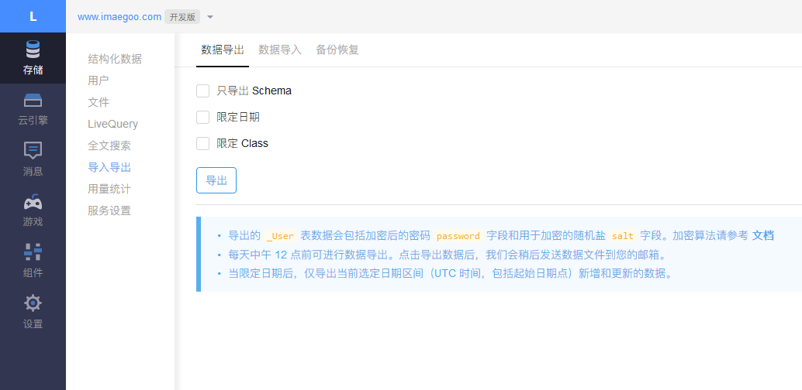
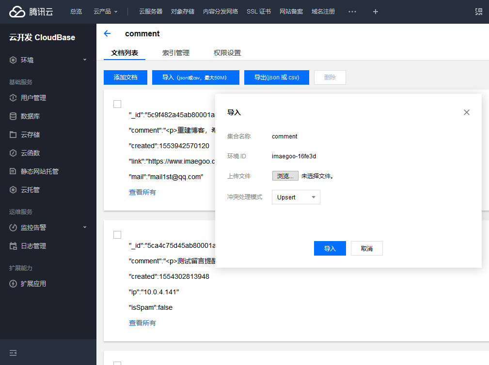

# Valine 到 Twikoo 迁移脚本

## 使用说明

1. 下载该脚本，执行脚本需要您的电脑安装有 node.js 环境，如果没有，请一同安装
2. 登录 LeanCloud 控制台[华北节点](https://leancloud.cn/applist.html) / [华东节点](https://tab.leancloud.cn/applist.html) / [国际版](https://console.leancloud.app/applist.html)
3. 进入 Valine 所在应用，选择 **存储 - 导入导出 - 数据导出 - 导出**

4. 解压导出的文件，将里面的 `Comment.json` 放到脚本相同路径下
5. 执行 `node migrator-comment.js`，执行完毕后会生成 `output-commment.json` 文件
6. 进入云开发数据库管理后台，导入刚刚生成的文件到 `comment` 数据库

